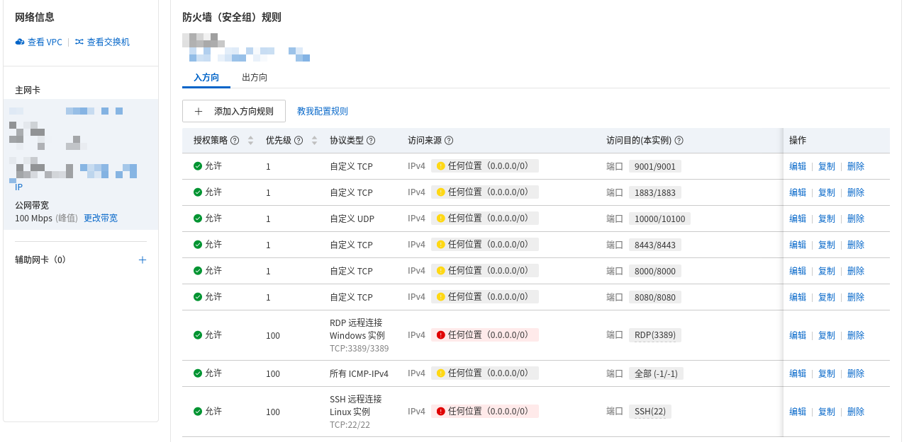

# Aliyun ECS Deployment Guide (WebRTC + MQTT Gateway)

This guide deploys the `webrtc_public_gateway` stack on an Aliyun ECS Linux server.

## 1) Prepare ECS

1. Create an ECS instance (Ubuntu 22.04 or similar).
2. Assign a public IP (EIP or direct public IP).
3. Ensure security group/firewall rules are configured.

## 2) Security Group / Firewall Rules

Inbound rules are:

- TCP `9001` (MQTT over WebSocket)
- TCP `1883` (MQTT plain TCP)
- UDP `10000` (Janus RTP/RTCP media)
- TCP `8443` (HTTPS/Caddy)
- TCP `8000` (Janus HTTP API)
- TCP `8080` (web app entry / HTTP)
- TCP `22` (SSH)
- ICMP enabled



Recommended hardening after validation:

- Restrict `22` to your office/home IP only.
- Restrict `1883`/`9001` to clients that really need access.
- Keep `10000/udp` open for WebRTC media.

## 3) Install Docker

```bash
sudo apt-get update
sudo apt-get install -y ca-certificates curl gnupg
sudo install -m 0755 -d /etc/apt/keyrings
curl -fsSL https://download.docker.com/linux/ubuntu/gpg | sudo gpg --dearmor -o /etc/apt/keyrings/docker.gpg
echo \
  "deb [arch=$(dpkg --print-architecture) signed-by=/etc/apt/keyrings/docker.gpg] https://download.docker.com/linux/ubuntu \
  $(. /etc/os-release && echo "$VERSION_CODENAME") stable" | \
  sudo tee /etc/apt/sources.list.d/docker.list > /dev/null
sudo apt-get update
sudo apt-get install -y docker-ce docker-ce-cli containerd.io docker-buildx-plugin docker-compose-plugin
sudo systemctl enable docker
sudo systemctl start docker
```

## 4) Upload project and bootstrap config

```bash
git clone <your-repo-url>
cd Esp32Demos/webrtc_public_gateway
```

Generate Janus/MQTT secrets and sync settings to gateway + firmware config:

```bash
./scripts/bootstrap_janus_and_sdkconfig.sh \
  --room-id 1234 \
  --signal-url http://<ECS_PUBLIC_IP>:8080/janus \
  --mqtt-broker-uri mqtt://<ECS_PUBLIC_IP>:1883
```

Notes:

- The script also updates firmware-side `sdkconfig` values.
- `nat_1_1_mapping` will use your signal URL host IP (already integrated in your script flow).

## 5) Start gateway services

```bash
cd /home/<your-user>/Esp32Demos/webrtc_public_gateway
docker compose up -d --force-recreate
docker compose ps
```

Check logs:

```bash
docker compose logs -f janus-gateway
docker compose logs -f mqtt-broker
docker compose logs -f webrtc-edge
```

## 6) Verify from browser

Open:

- `http://<ECS_PUBLIC_IP>:8080/`

Then:

1. Enter `Room ID` and `Room PIN`.
2. Connect MQTT first.
3. Web will send `OPEN_WEBRTC` + heartbeat.
4. Wait for status and auto WebRTC attach.

## 7) ESP32 side settings

Ensure both firmware projects point to ECS public IP:

- P4 signaling URL -> `ws://<ECS_PUBLIC_IP>:8188` (or your proxied endpoint)
- P4 MQTT broker -> `mqtt://<ECS_PUBLIC_IP>:1883`
- C3 is local CAN receiver only (no cloud endpoint needed).

## 8) Common issues

1. `ICE failed` on Janus:
- Usually `10000/udp` blocked or NAT/public mapping mismatch.

2. MQTT timeout / connect fail:
- Check `1883` and `9001` inbound rules.
- Verify broker user/pass (`ROOM_ID` / `ROOM_PIN` in your current setup).

3. `listen tcp :80: bind: address already in use`:
- Another process is using port 80.
- Stop conflicting service or change compose port mapping.

4. Web works but no video:
- Confirm ESP32 published `OPEN_WEBRTC` result and Janus room/pin match.
- Confirm status topic reports `webrtc: ready`.

## 9) Production recommendations

- Use domain + TLS cert on Caddy.
- Restrict inbound CIDR ranges wherever possible.
- Rotate `admin_secret`, `room_pin`, and `room_secret` periodically.
- Keep Docker images and host patched.
