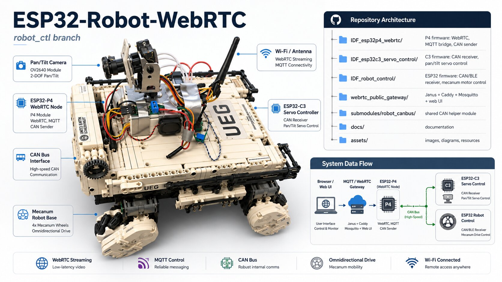
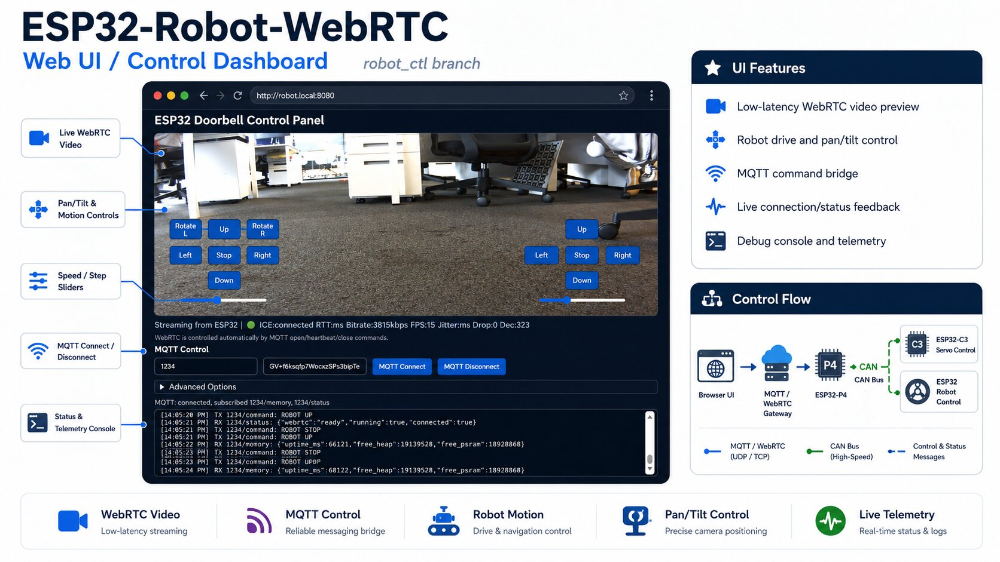
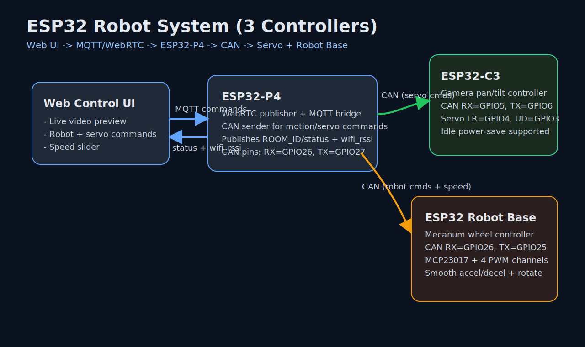
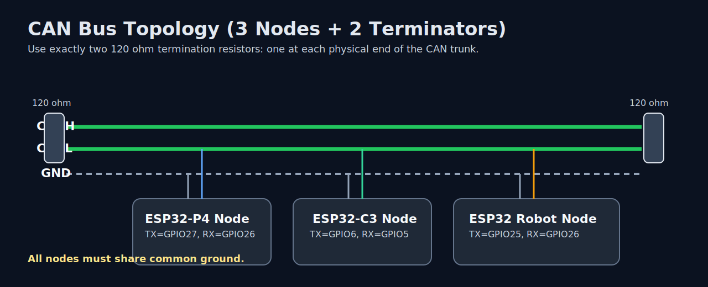
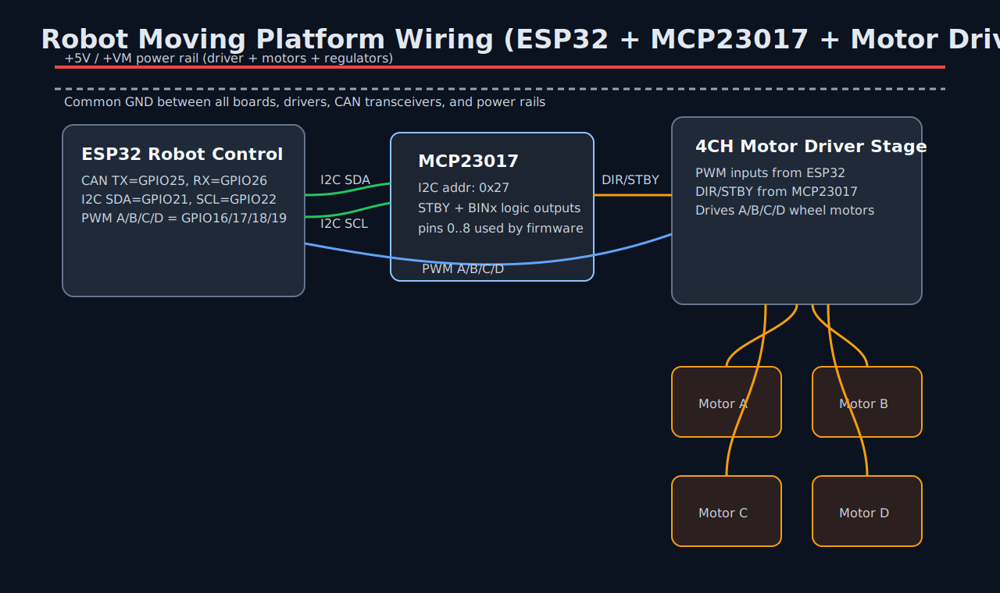

# ESP32-Robot-WebRTC

This repo is an ESP-IDF workspace for a 3-controller robot system:

1. ESP32-P4: WebRTC + MQTT/network bridge
2. ESP32-C3: camera pan/tilt servo controller (via CAN)
3. ESP32 (classic): mecanum robot moving platform controller (via CAN + motor driver)





https://github.com/user-attachments/assets/272ed0e9-eee6-451c-b6ee-d79298cd6af2


## Main capabilities

- Browser remote control with WebRTC video
- MQTT command and status channel
- MQTT -> CAN forwarding for robot motion and servo control
- Adjustable robot speed (`ROBOT_SPEED`) propagated from web/MQTT to CAN receivers
- WebRTC status publish to `ROOM_ID/status`, including `wifi_rssi`
- Smooth robot acceleration/deceleration on motion commands

## Repo layout

- `IDF_esp32p4_webrtc/`: P4 firmware (WebRTC, MQTT bridge, CAN sender)
- `IDF_esp32c3_servo_control/`: C3 firmware (CAN receiver, dual-servo control)
- `IDF_robot_control/`: ESP32 firmware (CAN/BLE receiver, mecanum motor control)
- `webrtc_public_gateway/`: Janus + Caddy + Mosquitto gateway and web UI
- `submodules/robot_canbus/`: shared CAN helper module









## Quick start

### 1) Bootstrap gateway + sdkconfig

```bash
cd webrtc_public_gateway
cp .env.example .env
./scripts/bootstrap_janus_and_sdkconfig.sh \
  --room-id 1234 \
  --signal-url http://192.168.19.25:8080/janus \
  --mqtt-broker-uri mqtt://192.168.19.25:1883
```

### 2) Start gateway

```bash
cd webrtc_public_gateway
docker compose up -d --force-recreate
```

Open `http://<your-host-ip>:8080/`.

### 3) Flash firmware

```bash
source "$IDF_PATH/export.sh"

cd IDF_esp32p4_webrtc
idf.py build flash monitor

cd ../IDF_esp32c3_servo_control
idf.py build flash monitor

cd ../IDF_robot_control
idf.py build flash monitor
```

## Runtime data flow

1. Web app connects MQTT and sends `OPEN_WEBRTC` + `HEARTBEAT`.
2. ESP32-P4 starts WebRTC and publishes status on `ROOM_ID/status`.
3. Control commands (`ROBOT_*`, `SERVO_*`, `ROBOT_SPEED:*`, `SERVO_STEP:*`) are received by P4.
4. P4 forwards control commands over CAN.
5. ESP32-C3 handles servo commands.
6. ESP32 robot controller handles movement commands.

## Hardware and wiring

Detailed connection guide is in:

- [Hardware Wiring Guide](docs/HARDWARE_WIRING.md)

This includes:

- pin-by-pin tables for all 3 controllers
- CAN transceiver and termination rules
- power and grounding recommendations
- MCP23017 + motor driver wiring notes for robot base

## Other docs

- [Aliyun ECS Deployment Guide (WebRTC + MQTT Gateway)](webrtc_public_gateway/ALIYUN_ECS_DEPLOYMENT.md)
- [Gateway details](webrtc_public_gateway/README.md)
- [MQTT-Controlled WebRTC Flow](webrtc_public_gateway/MQTT_WEBRTC_CONTROL_FLOW.md)
- [Hardware List](HARDWARE_LIST.md)
